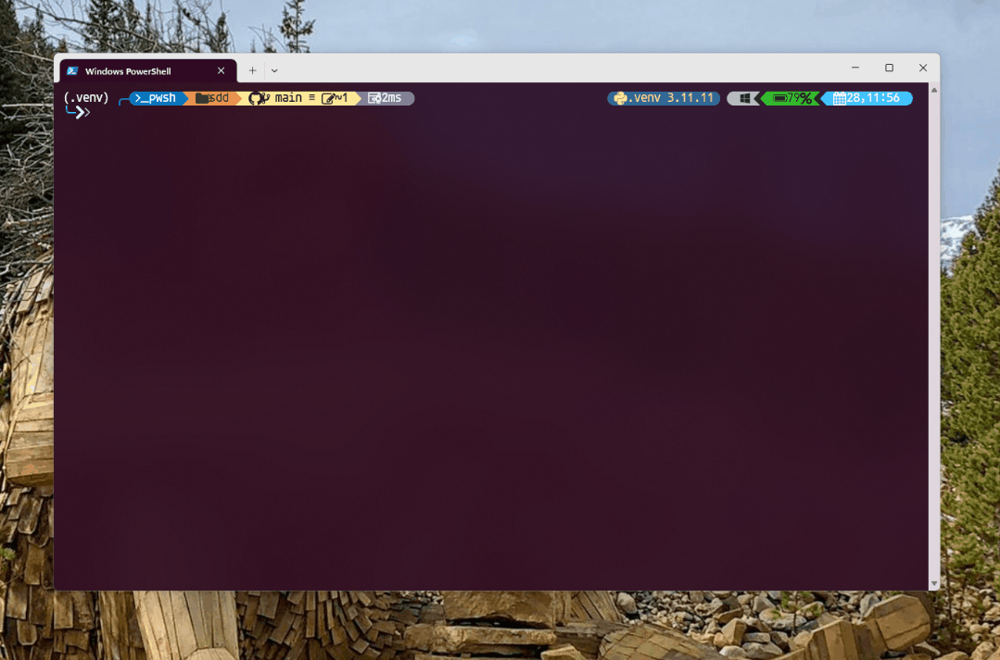

<div align="center">
    
    <h1>🌱 Kite</h1>
    <h3><em>SDLC for non-technical builders.</em></h3>
</div>

<p align="center">
    <strong>Kite is a founder-first toolkit that turns a one-sentence idea into project principles, a delivery plan, and a guided backend, frontend, and QA implementation loop inside your favourite AI coding assistant.</strong>
</p>

---

## Table of Contents

- [🤔 What is Spec-Driven Development?](#-what-is-spec-driven-development)
- [⚡ Get Started](#-get-started)
- [🤖 Supported AI Coding Agent Integrations](#-supported-ai-coding-agent-integrations)
- [🔧 Kite CLI Reference](#-kite-cli-reference)
- [📚 Core Philosophy](#-core-philosophy)
- [🌟 Development Phases](#-development-phases)
- [🎯 Experimental Goals](#-experimental-goals)
- [🔧 Prerequisites](#-prerequisites)
- [📖 Learn More](#-learn-more)
- [📋 Detailed Process](#-detailed-process)
- [🔍 Troubleshooting](#-troubleshooting)
- [💬 Support](#-support)
- [🙏 Acknowledgements](#-acknowledgements)
- [📄 License](#-license)

## 🤔 What is Spec-Driven Development?

Kite uses Spec-Driven Development as its operating model, but packages it as a guided workflow for builders who want plain-English progress instead of framework jargon. In Kite, the spec is not a dead document: it drives the design brief, plan, task list, and implementation loop.

## ⚡ Get Started

### 1. Start with Kite

Choose your preferred setup path:

> **Important:** Install Kite from your approved internal source or from a local checkout of this repository. Any packages with the same name on PyPI are **not** affiliated with this customized version.

#### Option 1: Dev Container (Recommended for New Builders)

Use this when you want a ready VS Code workspace and do not want to install
Python, Node, Docker tooling, and Kite by hand.

```bash
mkdir my-app
cd my-app
curl -fsSL https://raw.githubusercontent.com/Karnonson/kite/main/scripts/install-devcontainer.sh | bash
code .
```

In VS Code, run **Dev Containers: Reopen in Container** from the Command
Palette. Kite installs automatically and initializes the workspace with the
default `copilot` integration.

When the container is ready, open Copilot Chat and run:

```text
/kite.start "Build a tool that helps me <describe your idea>."
```

See the [Dev Container Guide](./docs/devcontainer.md) for details.

#### Option 2: Persistent CLI Installation

Install once and use everywhere. Pin a specific release tag for stability (check [Releases](https://github.com/Karnonson/kite/releases) for the latest):

```bash
# Install a specific stable release (recommended — replace vX.Y.Z with the latest tag)
uv tool install kite-cli --from git+https://github.com/Karnonson/kite.git@vX.Y.Z

# Or install latest from main (may include unreleased changes)
uv tool install kite-cli --from git+https://github.com/Karnonson/kite.git

# Alternative: using pipx (also works)
pipx install git+https://github.com/Karnonson/kite.git@vX.Y.Z
pipx install git+https://github.com/Karnonson/kite.git
```

Then verify the correct version is installed:

```bash
kite version
```

And use the tool directly:

```bash
# Initialize the current directory
kite init --integration copilot

# Or create a new project directory explicitly
kite init <PROJECT_NAME> --integration copilot

# Run detected project checks from .kite/project-context.json
kite check

# Check installed tools and agent CLIs
kite check --tools
```

To upgrade Kite, see the [Upgrade Guide](./docs/upgrade.md) for detailed instructions. Safe dry-run:

```bash
kite self upgrade
```

Apply the detected `uv tool` or `pipx` upgrade command after confirmation:

```bash
kite self upgrade --apply
```

**Benefits of persistent installation:**

- Tool stays installed and available in PATH
- No need to create shell aliases
- Better tool management with `uv tool list`, `uv tool upgrade`, `uv tool uninstall`
- Cleaner shell configuration

#### Option 3: One-time Usage

Run directly without installing:

```bash
# Initialize the current directory
uvx --from git+https://github.com/Karnonson/kite.git@vX.Y.Z kite init --integration copilot

# Or create a new project directory explicitly
uvx --from git+https://github.com/Karnonson/kite.git@vX.Y.Z kite init <PROJECT_NAME> --integration copilot
```

#### Option 4: Enterprise / Air-Gapped Installation

If your environment blocks access to PyPI or GitHub, see the [Enterprise / Air-Gapped Installation](./docs/installation.md#enterprise--air-gapped-installation) guide for step-by-step instructions on using `pip download` to create portable, OS-specific wheel bundles on a connected machine.

### 2. Founder fast path (recommended)

Launch your coding agent in the project directory. Most agents expose Kite as `/kite.*` slash commands; skills-based integrations use agent-native skill syntax such as `/kite-*`, `$kite-*`, or `/skill:kite-*`.

If you just want Kite to walk you through the whole lifecycle in plain English, run:

```bash
/kite.start "Build a tool that <one-sentence description of your idea>."
```

`/kite.start` chains Constitution → Discover → Specify → Design → Clarify → Plan → Tasks → Backend → Frontend → QA, pausing for a plain-English approval before major planning and build handoffs. The planning and coding agents can call the `kite.research` subagent internally when they need current official framework guidance. If anything pauses or breaks, run `kite resume` in a terminal to pick up where you left off, `kite doctor` for a plain-language status report, or `kite check` to run the validation commands Kite detected for the project.

Prefer to drive each stage manually? The classic step-by-step flow is below.

### 3. Establish project principles (manual flow)

Use the **`/kite.constitution`** command to create your project's governing principles and development guidelines that will guide all subsequent development.

```bash
/kite.constitution Create principles focused on code quality, testing standards, user experience consistency, and performance requirements
```

### 4. Explore the problem

Use the **`/kite.discover`** command to turn your one-line idea into a plain-English discovery brief before you lock the scope.

```bash
/kite.discover Build an application that can help me organize my photos in separate photo albums.
```

### 5. Create the spec

Use the **`/kite.specify`** command to describe what you want to build. Focus on the **what** and **why**, not the tech stack.

```bash
/kite.specify Build an application that can help me organize my photos in separate photo albums. Albums are grouped by date and can be re-organized by dragging and dropping on the main page. Albums are never in other nested albums. Within each album, photos are previewed in a tile-like interface.
```

### 6. Create a design brief

Use the **`/kite.design`** command to define the user experience, information hierarchy, and page-level behavior before implementation.

```bash
/kite.design persona=founder
```

### 7. Run a final clarification pass

Use the **`/kite.clarify`** command after design to make sure nothing important is missing before technical planning starts.

```bash
/kite.clarify Focus on anything that would create planning rework later.
```

### 8. Create a technical implementation plan

Use the **`/kite.plan`** command to provide your tech stack and architecture choices. When the plan needs current framework versions, hosting guidance, or AI SDK capability checks, it should invoke the `kite.research` subagent internally rather than treating research as a separate founder-facing step.

```bash
/kite.plan The application uses Vite with minimal number of libraries. Use vanilla HTML, CSS, and JavaScript as much as possible. Images are not uploaded anywhere and metadata is stored in a local SQLite database.
```

### 9. Break down into tasks

Use **`/kite.tasks`** to create an actionable task list from your implementation plan.

```bash
/kite.tasks
```

### 10. Build the backend

Use **`/kite.backend`** to complete backend-tagged tasks and publish the contract the frontend will use.

```bash
/kite.backend
```

### 11. Build the frontend

Use **`/kite.frontend`** after the backend contract is complete.

```bash
/kite.frontend
```

### 12. Run QA

Use **`/kite.qa`** to implement QA-tagged tasks, run the checks, and append a plain-English report.

```bash
/kite.qa
```

For detailed step-by-step instructions, see our [comprehensive guide](./spec-driven.md).

## 🤖 Supported AI Coding Agent Integrations

Kite works with 25+ AI coding agents — both CLI tools and IDE-based assistants. See the full list with notes and usage details in the [Supported AI Coding Agent Integrations](docs/reference/integrations.md) guide.

Run `kite integration list` to see all available integrations in your installed version.

## Available Slash Commands

<<<<<<< HEAD
After running `kite init`, your AI coding agent will have access to slash commands for structured development. Use `--profile minimal`, `--profile standard` (default), or `--profile full` to control how many commands are installed. For integrations that support skills mode, passing `--integration <agent> --integration-options="--skills"` installs agent skills instead of slash-command prompt files.
=======
After running `kite init`, your AI coding agent will have access to these workflow commands for structured development. Some integrations install them as slash-command prompt files; skills-based integrations install `kite-<command>/SKILL.md` skills and may use agent-native invocation syntax.
>>>>>>> 44c835fea6714e0882fd74d4ac69ce0f42089919

### Core Commands

Essential commands for the founder-first Kite workflow:

| Command                  | Agent Skill            | Description                                                                |
| ------------------------ | ---------------------- | -------------------------------------------------------------------------- |
| `/kite.start`         | `kite-start`        | Run the guided end-to-end loop with approval gates                         |
| `/kite.constitution`  | `kite-constitution` | Create or update project governing principles and development guidelines   |
| `/kite.discover`      | `kite-discover`     | Turn a one-line idea into a discovery brief in plain English               |
| `/kite.specify`       | `kite-specify`      | Define what you want to build (requirements and user stories)              |
| `/kite.design`        | `kite-design`       | Produce a text-only UX and page-layout brief                               |
| `/kite.clarify`       | `kite-clarify`      | Run a post-design clarification pass before technical planning             |
| `/kite.plan`          | `kite-plan`         | Create technical implementation plans with your chosen tech stack          |
| `/kite.tasks`         | `kite-tasks`        | Generate actionable task lists for implementation                          |
| `/kite.backend`       | `kite-backend`      | Implement backend-tagged tasks and publish the frontend contract           |
| `/kite.frontend`      | `kite-frontend`     | Implement frontend-tagged tasks against the published contract             |
| `/kite.docs`          | `kite-docs`         | Update user-facing documentation before QA                                |
| `/kite.qa`            | `kite-qa`           | Run QA-tagged tasks and append the plain-English QA report                 |

### Optional Commands

Additional commands for enhanced quality and validation. Copilot's default `standard` profile keeps the agent list small and includes only the core workflow plus `kite.research`; use `--profile minimal` for only the guided workflow commands or `--profile full` when you want every optional command installed.

| Command              | Agent Skill            | Description                                                                                                                          |
| -------------------- | ---------------------- | ------------------------------------------------------------------------------------------------------------------------------------ |
| `/kite.research`  | `kite-research`     | Internal research helper used by plan and coding agents to verify current official stack guidance                                  |
| `/kite.analyze`   | `kite-analyze`      | Cross-artifact consistency & coverage analysis (run after `/kite.tasks`, before `/kite.backend`)                                |
| `/kite.checklist` | `kite-checklist`    | Generate custom quality checklists that validate requirements completeness, clarity, and consistency (like "unit tests for English") |
| `/kite.taskstoissues` | `kite-taskstoissues`| Convert generated task lists into GitHub issues for tracking and execution                                                     |
| `/kite.implement` | `kite-implement`    | Legacy single-pass implementation helper for custom flows that do not need split handoffs                                       |

## 🔧 Kite CLI Reference

For full command details, options, and examples, see the [CLI Reference](docs/reference/overview.md).

### Install profiles

Use `--profile` with `kite init` (or `kite integration install`/`switch`/`upgrade`) to control how many Kite commands are installed:

| Profile    | Commands installed                                              |
| ---------- | --------------------------------------------------------------- |
| `minimal`  | Guided workflow only (`kite.start` + core stage agents)         |
| `standard` | Core workflow + `kite.research` (default)                       |
| `full`     | Every Kite command including optional review helpers            |

To check or change the profile for an existing project:

```bash
kite profile              # show current profile
kite profile set full     # change to full (update JSON only)
kite profile set minimal --upgrade   # change and immediately regenerate agents
```

### Project context and validation

During `kite init`, Kite writes `.kite/project-context.json` with detected
stack details, repository evidence, and validation commands such as package
scripts, `pytest`, `go test ./...`, or `cargo test`. Agents are instructed to
read this file before asking brownfield questions about existing behavior.

Run `kite check` from a Kite project to refresh that context and execute the
detected validation pipeline. Use `kite check --no-refresh-context` to run the
saved commands exactly as-is, or `kite check --tools` for the older environment
check that reports installed tools and agent CLIs.

## 📚 Core Philosophy

Kite uses Spec-Driven Development as a practical operating model:

- **Intent-driven development** where specifications define the "*what*" before the "*how*"
- **Rich specification creation** using guardrails and organizational principles
- **Multi-step refinement** rather than one-shot code generation from prompts
- **Heavy reliance** on advanced AI model capabilities for specification interpretation

## 🌟 Development Phases

| Phase                                    | Focus                    | Key Activities                                                                                                                                                     |
| ---------------------------------------- | ------------------------ | ------------------------------------------------------------------------------------------------------------------------------------------------------------------ |
| **0-to-1 Development** ("Greenfield")    | Generate from scratch    | <ul><li>Start with high-level requirements</li><li>Generate specifications</li><li>Plan implementation steps</li><li>Build production-ready applications</li></ul> |
| **Creative Exploration**                 | Parallel implementations | <ul><li>Explore diverse solutions</li><li>Support multiple technology stacks & architectures</li><li>Experiment with UX patterns</li></ul>                         |
| **Iterative Enhancement** ("Brownfield") | Brownfield modernization | <ul><li>Add features iteratively</li><li>Modernize legacy systems</li><li>Adapt processes</li></ul>                                                                |

## 🎯 Experimental Goals

Our research and experimentation focus on:

### Technology independence

- Create applications using diverse technology stacks
- Validate the hypothesis that Spec-Driven Development is a process not tied to specific technologies, programming languages, or frameworks

### Enterprise constraints

- Demonstrate mission-critical application development
- Incorporate organizational constraints (cloud providers, tech stacks, engineering practices)
- Support enterprise design systems and compliance requirements

### User-centric development

- Build applications for different user cohorts and preferences
- Support various development approaches (from vibe-coding to AI-native development)

### Creative & iterative processes

- Validate the concept of parallel implementation exploration
- Provide robust iterative feature development workflows
- Extend processes to handle upgrades and modernization tasks

## 🔧 Prerequisites

- **Linux**
- [Supported](#-supported-ai-coding-agent-integrations) AI coding agent.
- [uv](https://docs.astral.sh/uv/) for package management (recommended) or [pipx](https://pypa.github.io/pipx/) for persistent installation
- [Python 3.11+](https://www.python.org/downloads/)
- [Git](https://git-scm.com/downloads)

If you encounter issues with an agent, please open an issue so we can refine the integration.

## 📖 Learn More

- **[Complete Spec-Driven Development Methodology](./spec-driven.md)** - Deep dive into the full process
- **[Detailed Walkthrough](#-detailed-process)** - Step-by-step implementation guide

---

## 📋 Detailed Process

<details>
<summary>Click to expand the detailed step-by-step walkthrough</summary>

You can use the Kite CLI to bootstrap your project, which will bring in the required artifacts in your environment. From the project directory, run:

```bash
kite init
```

To create a new project directory explicitly, pass a name:

```bash
kite init <project_name>

# Skip confirmation when the current directory already has files
kite init --force
```



You will be prompted to select the coding agent integration you are using. You can also proactively specify it directly in the terminal:

```bash
kite init --integration copilot
kite init --integration gemini
kite init --integration codex
kite init --integration copilot --profile minimal   # lean setup
kite init --integration copilot --profile full      # everything

# Or create a new directory explicitly:
kite init <project_name> --integration copilot
kite init <project_name> --integration codex --integration-options="--skills"

# Force merge into a non-empty current directory
kite init --force --integration copilot
```

The CLI will check if you have Claude Code, Gemini CLI, Cursor CLI, Qwen CLI, opencode, Codex CLI, Qoder CLI, Tabnine CLI, Kiro CLI, Pi, Forge, Goose, or Mistral Vibe installed. If you do not, or you prefer to get the templates without checking for the right tools, use `--ignore-agent-tools` with your command:

```bash
kite init --integration copilot --ignore-agent-tools
```

### **STEP 1:** Establish project principles

Go to the project folder and run your coding agent. In our example, we're using `claude`.


You will know that things are configured correctly if you see the `/kite.constitution`, `/kite.discover`, `/kite.design`, `/kite.plan`, `/kite.tasks`, `/kite.backend`, `/kite.frontend`, and `/kite.qa` commands available.

The first step should be establishing your project's governing principles using the `/kite.constitution` command. This helps ensure consistent decision-making throughout all subsequent development phases:

```text
/kite.constitution Create principles focused on code quality, testing standards, user experience consistency, and performance requirements. Include governance for how these principles should guide technical decisions and implementation choices.
```

This step creates or updates the `.kite/memory/constitution.md` file with your project's foundational guidelines that the coding agent will reference during specification, planning, and implementation phases.

### **STEP 2:** Create project specifications

With your project principles established, you can now create the functional specifications. Use the `/kite.specify` command and then provide the concrete requirements for the project you want to develop.

> [!IMPORTANT]
> Be as explicit as possible about *what* you are trying to build and *why*. **Do not focus on the tech stack at this point**.

An example prompt:

```text
Develop Taskify, a team productivity platform. It should allow users to create projects, add team members,
assign tasks, comment and move tasks between boards in Kanban style. In this initial phase for this feature,
let's call it "Create Taskify," let's have multiple users but the users will be declared ahead of time, predefined.
I want five users in two different categories, one product manager and four engineers. Let's create three
different sample projects. Let's have the standard Kanban columns for the status of each task, such as "To Do,"
"In Progress," "In Review," and "Done." There will be no login for this application as this is just the very
first testing thing to ensure that our basic features are set up. For each task in the UI for a task card,
you should be able to change the current status of the task between the different columns in the Kanban work board.
You should be able to leave an unlimited number of comments for a particular card. You should be able to, from that task
card, assign one of the valid users. When you first launch Taskify, it's going to give you a list of the five users to pick
from. There will be no password required. When you click on a user, you go into the main view, which displays the list of
projects. When you click on a project, you open the Kanban board for that project. You're going to see the columns.
You'll be able to drag and drop cards back and forth between different columns. You will see any cards that are
assigned to you, the currently logged in user, in a different color from all the other ones, so you can quickly
see yours. You can edit any comments that you make, but you can't edit comments that other people made. You can
delete any comments that you made, but you can't delete comments anybody else made.
```

After this prompt is entered, you should see Claude Code kick off the planning and spec drafting process. Claude Code will also trigger some of the built-in scripts to set up the repository.

Once this step is completed, you should have a new branch created (e.g., `001-create-taskify`), as well as a new specification in the `specs/001-create-taskify` directory.

The produced specification should contain a set of user stories and functional requirements, as defined in the template.

At this stage, your project folder contents should resemble the following:

```text
└── .kite
    ├── memory
    │  └── constitution.md
    ├── scripts
    │  ├── check-prerequisites.sh
    │  ├── common.sh
    │  ├── create-new-feature.sh
    │  ├── setup-plan.sh
    │  └── update-claude-md.sh
    ├── specs
    │  └── 001-create-taskify
    │      └── spec.md
    └── templates
        ├── plan-template.md
        ├── spec-template.md
        └── tasks-template.md
```

### **STEP 3:** Functional specification clarification (required before planning)

With the baseline specification created, you can go ahead and clarify any of the requirements that were not captured properly within the first shot attempt.

You should run the structured clarification workflow **before** creating a technical plan to reduce rework downstream.

Preferred order:

1. Use `/kite.clarify` (structured) – sequential, coverage-based questioning that records answers in a Clarifications section.
2. Optionally follow up with ad-hoc free-form refinement if something still feels vague.

If you intentionally want to skip clarification (e.g., spike or exploratory prototype), explicitly state that so the agent doesn't block on missing clarifications.

Example free-form refinement prompt (after `/kite.clarify` if still needed):

```text
For each sample project or project that you create there should be a variable number of tasks between 5 and 15
tasks for each one randomly distributed into different states of completion. Make sure that there's at least
one task in each stage of completion.
```

You should also ask Claude Code to validate the **Review & Acceptance Checklist**, checking off the things that are validated/pass the requirements, and leave the ones that are not unchecked. The following prompt can be used:

```text
Read the review and acceptance checklist, and check off each item in the checklist if the feature spec meets the criteria. Leave it empty if it does not.
```

It's important to use the interaction with Claude Code as an opportunity to clarify and ask questions around the specification - **do not treat its first attempt as final**.

### **STEP 4:** Generate a plan

You can now be specific about the tech stack and other technical requirements. You can use the `/kite.plan` command that is built into the project template with a prompt like this:

```text
We are going to generate this using .NET Aspire, using Postgres as the database. The frontend should use
Blazor server with drag-and-drop task boards, real-time updates. There should be a REST API created with a projects API,
tasks API, and a notifications API.
```

The output of this step will include a number of implementation detail documents, with your directory tree resembling this:

```text
.
├── CLAUDE.md
├── memory
│  └── constitution.md
├── scripts
│  ├── check-prerequisites.sh
│  ├── common.sh
│  ├── create-new-feature.sh
│  ├── setup-plan.sh
│  └── update-claude-md.sh
├── specs
│  └── 001-create-taskify
│      ├── contracts
│      │  ├── api-spec.json
│      │  └── signalr-spec.md
│      ├── data-model.md
│      ├── plan.md
│      ├── quickstart.md
│      ├── research.md
│      └── spec.md
└── templates
    ├── CLAUDE-template.md
    ├── plan-template.md
    ├── spec-template.md
    └── tasks-template.md
```

Check the `research.md` document to ensure that the right tech stack is used, based on your instructions. You can ask Claude Code to refine it if any of the components stand out, or even have it check the locally-installed version of the platform/framework you want to use (e.g., .NET).

Additionally, you might want to ask Claude Code to research details about the chosen tech stack if it's something that is rapidly changing (e.g., .NET Aspire, JS frameworks), with a prompt like this:

```text
I want you to go through the implementation plan and implementation details, looking for areas that could
benefit from additional research as .NET Aspire is a rapidly changing library. For those areas that you identify that
require further research, I want you to update the research document with additional details about the specific
versions that we are going to be using in this Taskify application and spawn parallel research tasks to clarify
any details using research from the web.
```

During this process, you might find that Claude Code gets stuck researching the wrong thing - you can help nudge it in the right direction with a prompt like this:

```text
I think we need to break this down into a series of steps. First, identify a list of tasks
that you would need to do during implementation that you're not sure of or would benefit
from further research. Write down a list of those tasks. And then for each one of these tasks,
I want you to spin up a separate research task so that the net results is we are researching
all of those very specific tasks in parallel. What I saw you doing was it looks like you were
researching .NET Aspire in general and I don't think that's gonna do much for us in this case.
That's way too untargeted research. The research needs to help you solve a specific targeted question.
```

> [!NOTE]
> Claude Code might be over-eager and add components that you did not ask for. Ask it to clarify the rationale and the source of the change.

### **STEP 5:** Have Claude Code validate the plan

With the plan in place, you should have Claude Code run through it to make sure that there are no missing pieces. You can use a prompt like this:

```text
Now I want you to go and audit the implementation plan and the implementation detail files.
Read through it with an eye on determining whether or not there is a sequence of tasks that you need
to be doing that are obvious from reading this. Because I don't know if there's enough here. For example,
when I look at the core implementation, it would be useful to reference the appropriate places in the implementation
details where it can find the information as it walks through each step in the core implementation or in the refinement.
```

This helps refine the implementation plan and helps you avoid potential blind spots that Claude Code missed in its planning cycle. Once the initial refinement pass is complete, ask Claude Code to go through the checklist once more before you can get to the implementation.

You can also ask Claude Code (if you have the [GitHub CLI](https://docs.github.com/en/github-cli/github-cli) installed) to go ahead and create a pull request from your current branch to `main` with a detailed description, to make sure that the effort is properly tracked.

> [!NOTE]
> Before you have the agent implement it, it's also worth prompting Claude Code to cross-check the details to see if there are any over-engineered pieces (remember - it can be over-eager). If over-engineered components or decisions exist, you can ask Claude Code to resolve them. Ensure that Claude Code follows the [constitution](base/memory/constitution.md) as the foundational piece that it must adhere to when establishing the plan.

### **STEP 6:** Generate task breakdown with /kite.tasks

With the implementation plan validated, you can now break down the plan into specific, actionable tasks that can be executed in the correct order. Use the `/kite.tasks` command to automatically generate a detailed task breakdown from your implementation plan:

```text
/kite.tasks
```

This step creates a `tasks.md` file in your feature specification directory that contains:

- **Task breakdown organized by user story** - Each user story becomes a separate implementation phase with its own set of tasks
- **Dependency management** - Tasks are ordered to respect dependencies between components (e.g., models before services, services before endpoints)
- **Parallel execution markers** - Tasks that can run in parallel are marked with `[P]` to optimize development workflow
- **File path specifications** - Each task includes the exact file paths where implementation should occur
- **Test-driven development structure** - If tests are requested, test tasks are included and ordered to be written before implementation
- **Checkpoint validation** - Each user story phase includes checkpoints to validate independent functionality

The generated tasks.md provides a clear roadmap for `/kite.backend`, `/kite.frontend`, and `/kite.qa`, ensuring each slice can be implemented and checked before the next handoff.

### **STEP 7:** Backend, frontend, and QA

Once ready, run the split implementation commands in order:

```text
/kite.backend
/kite.frontend
/kite.qa
```

The split implementation flow will:

- Validate that all prerequisites are in place (constitution, spec, plan, and tasks)
- Parse the task breakdown from `tasks.md`
- Complete backend-tagged tasks and publish `contract.md`
- Complete frontend-tagged tasks against that contract
- Run QA-tagged tasks and append a plain-English report

> [!IMPORTANT]
> The coding agent will execute local CLI commands (such as `dotnet`, `npm`, etc.) - make sure you have the required tools installed on your machine.

Once the implementation is complete, test the application and resolve any runtime errors that may not be visible in CLI logs (e.g., browser console errors). You can copy and paste such errors back to your coding agent for resolution.

</details>

---

## 🔍 Troubleshooting

### Git Credential Manager on Linux

If you're having issues with Git authentication on Linux, you can install Git Credential Manager:

```bash
#!/usr/bin/env bash
set -e
echo "Downloading Git Credential Manager v2.6.1..."
wget https://github.com/git-ecosystem/git-credential-manager/releases/download/v2.6.1/gcm-linux_amd64.2.6.1.deb
echo "Installing Git Credential Manager..."
sudo dpkg -i gcm-linux_amd64.2.6.1.deb
echo "Configuring Git to use GCM..."
git config --global credential.helper manager
echo "Cleaning up..."
rm gcm-linux_amd64.2.6.1.deb
```

## 💬 Support

For support, please open a [GitHub issue](https://github.com/Karnonson/kite/issues/new). We welcome bug reports, feature requests, and questions about building with Kite.

## 🙏 Acknowledgements

Kite draws on earlier public work around spec-driven development, including research shared by [John Lam](https://github.com/jflam), while the workflow, product direction, and integrations in this repository are maintained as Kite.

## 📄 License

This project is licensed under the terms of the MIT open source license. Please refer to the [LICENSE](./LICENSE) file for the full terms.
