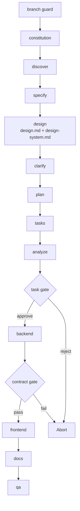

# Workflows

Workflows automate multi-step Kite processes by chaining commands, shell steps, and human checkpoints into repeatable sequences. The built-in founder workflow keeps the plain-English path intact while still splitting implementation into backend, frontend, docs, and QA stages.

## Run a Workflow

```bash
kite workflow run <source>
```

| Option | Description |
| --- | --- |
| `-i` / `--input` | Pass input values as `key=value` (repeatable) |

Runs a workflow from a catalog ID, URL, or local file path. Inputs declared by the workflow can be provided via `--input` or prompted interactively.

Example:

```bash
kite workflow run kite -i idea="Build a kanban board with drag-and-drop task management"
```

> **Note:** Workflow commands require a project already initialized with `kite init`.

## Resume a Workflow

```bash
kite workflow resume <run_id>
```

Resumes a paused or failed workflow run from the exact step where it stopped.

## Workflow Status

```bash
kite workflow status [<run_id>]
```

Shows the status of a specific run, or lists all runs if no ID is given. Run states: `created`, `running`, `completed`, `paused`, `failed`, `aborted`.

## List Installed Workflows

```bash
kite workflow list
```

Lists workflows installed in the current project.

## Install a Workflow

```bash
kite workflow add <source>
```

Installs a workflow from the catalog, a URL, or a local file path.

## Remove a Workflow

```bash
kite workflow remove <workflow_id>
```

Removes an installed workflow from the project.

## Search Available Workflows

```bash
kite workflow search [query]
```

| Option | Description |
| --- | --- |
| `--tag` | Filter by tag |

Searches all configured workflow catalogs.

## Workflow Info

```bash
kite workflow info <workflow_id>
```

Shows detailed information about a workflow, including its steps, inputs, and requirements.

## Catalog Management

Workflow catalogs control where `search` and `add` look for workflows. Catalogs are checked in priority order.

### List Catalogs

```bash
kite workflow catalog list
```

### Add a Catalog

```bash
kite workflow catalog add <url>
```

| Option | Description |
| --- | --- |
| `--name <name>` | Optional name for the catalog |

### Remove a Catalog

```bash
kite workflow catalog remove <index>
```

### Catalog Resolution Order

1. **Environment variable**: `KITE_WORKFLOW_CATALOG_URL` overrides all catalogs
2. **Project config**: `.kite/workflow-catalogs.yml`
3. **User config**: `~/.kite/workflow-catalogs.yml`
4. **Built-in defaults**: official catalog + community catalog

## Workflow Definition

Here is the shape of the built-in **Kite Full SDLC** workflow:

The design stage writes two coordinated artifacts: `design.md` for founder-facing page and flow intent, and `design-system.md` for AI-facing tokens and reusable component rules. Early review gates can be skipped with `auto_approve`, but the task-list gate, consistency analysis, branch guard, and contract gate remain mandatory before implementation continues.

```yaml
schema_version: "1.0"
workflow:
  id: "kite"
  name: "Kite Full SDLC"
  version: "0.5.0"
  author: "Kite"
  description: "Founder-friendly guided SDLC: constitution -> discover -> specify -> design -> clarify -> plan -> tasks -> analyze -> task gate -> backend -> contract gate -> frontend -> docs -> qa."

requires:
  kite_version: ">=0.7.2"
  integrations:
    any: ["copilot", "claude", "codex"]

inputs:
  idea:
    type: string
    required: true
    prompt: "What do you want to build? (one line is enough)"
  integration:
    type: string
    default: "copilot"
  persona:
    type: string
    default: "founder"
    enum: ["founder", "junior"]
  auto_approve:
    type: boolean
    default: false

steps:
  - id: branch-guard
    type: shell
    run: "stop on main/master when inside a git repo"
  - id: constitution
    command: kite.constitution
  - id: discover
    command: kite.discover
  - id: specify
    command: kite.specify
  - id: design
    command: kite.design
  - id: clarify
    command: kite.clarify
  - id: plan
    command: kite.plan
  - id: tasks
    command: kite.tasks
  - id: analyze
    command: kite.analyze
  - id: gate-tasks
    type: gate
    message: "Approve tasks.md and the consistency analysis before backend implementation?"
  - id: backend
    command: kite.backend
  - id: contract-gate
    type: shell
    run: "verify active FEATURE_DIR/contract.md"
  - id: frontend
    command: kite.frontend
  - id: docs
    command: kite.docs
  - id: qa
    command: kite.qa
```

This produces the following execution flow:



## Step Types

| Type | Purpose |
| --- | --- |
| `command` | Invoke a Kite command, such as `kite.plan` |
| `prompt` | Send an arbitrary prompt to the AI coding agent |
| `shell` | Execute a shell command and capture output |
| `gate` | Pause for human approval before continuing |
| `if` | Conditional branching |
| `switch` | Multi-branch dispatch on an expression |
| `while` | Loop while a condition is true |
| `do-while` | Execute at least once, then loop on condition |
| `fan-out` | Dispatch a step for each item in a list |
| `fan-in` | Aggregate results from a fan-out step |

## Expressions

Steps can reference inputs and previous step outputs using `{{ expression }}` syntax.

| Namespace | Description |
| --- | --- |
| `inputs.idea` | Workflow input values |
| `steps.specify.output.file` | Output from a previous step |
| `item` | Current item in a fan-out iteration |

Available filters: `default`, `join`, `contains`, `map`.

Example:

```yaml
condition: "{{ steps.test.output.exit_code == 0 }}"
args: "{{ inputs.idea }}"
message: "{{ status | default('pending') }}"
```

## Input Types

| Type | Coercion |
| --- | --- |
| `string` | Pass-through |
| `number` | `"42"` -> `42`, `"3.14"` -> `3.14` |
| `boolean` | `"true"` / `"1"` / `"yes"` -> `True` |

## State and Resume

Each workflow run persists its state at `.kite/workflows/runs/<run_id>/`:

- `state.json`: current run state and step progress
- `inputs.json`: resolved input values
- `log.jsonl`: step-by-step execution log

This enables `kite workflow resume` to continue from the exact step where a run was paused or failed.

## FAQ

### What happens when a workflow hits a gate step?

The workflow pauses and waits for human input. Run `kite workflow resume <run_id>` after reviewing to continue.

### Can I run the same workflow multiple times?

Yes. Each run gets a unique ID and its own state directory. Use `kite workflow status` to see all runs.

### Who maintains workflows?

Most workflows are independently created and maintained by their respective authors. The Kite maintainers do not review, audit, endorse, or support workflow code. Review a workflow's source before installing and use at your own discretion.
